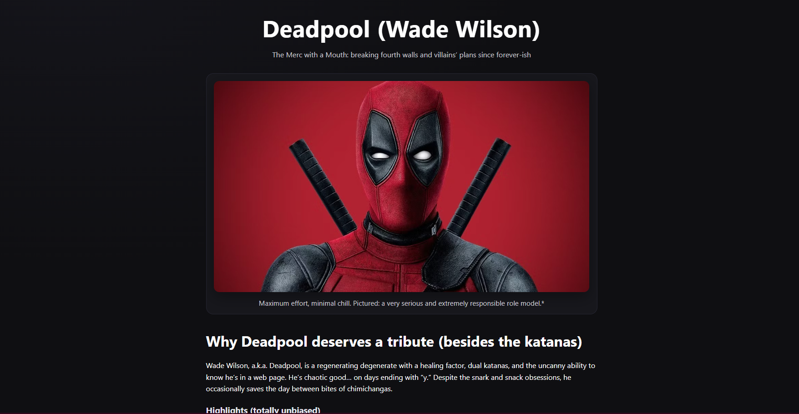

# Deadpool Tribute Page 🩸🔪🌯

A FreeCodeCamp tribute project… but with a twist.  
Instead of the usual historical figure, this one’s dedicated to Wade Wilson — aka Deadpool — the regenerating degenerate, katana collector, and professional fourth-wall demolisher.

---

## 🔥 Features

- **Responsive design** (FCC test-compliant).
- **Image block** with caption, centered and resizes correctly.
- **Tribute info** section: Deadpool “highlights” with maximum effort.
- **External link** to Marvel’s official Deadpool page (opens in new tab).
- Styled with **custom CSS variables**, gradients, and some Beanzie flair.

---

## 🚀 Live Demo

👉 [View on GitHub Pages](https://DJ-Beanz.github.io/tribute-deadpool/)

---

## 🛠️ Built With

- **HTML5** & **CSS3**
- **VS Code** + Live Server
- **GitHub Pages** for deployment

---

## 📚 About FreeCodeCamp Project

This project fulfills all the [FreeCodeCamp Tribute Page User Stories](https://tribute-page.freecodecamp.rocks).  
Check marks ✅ include:

- `#main`, `#title`, `#img-div`, `#image`, `#img-caption`, `#tribute-info`, and `#tribute-link`.
- Responsive image with `max-width: 100%` and `height: auto`.
- All elements correctly nested and testable.

---

## ⚠️ Disclaimer

- Image currently uses a placeholder (Unsplash).
- Swap in your own Deadpool fan art / licensed image if you’re sharing publicly — Deadpool will judge you either way.

---

### Credits

Built with ❤️, sarcasm, and a little **maximum effort** by LJG aka DJ Beanz.
